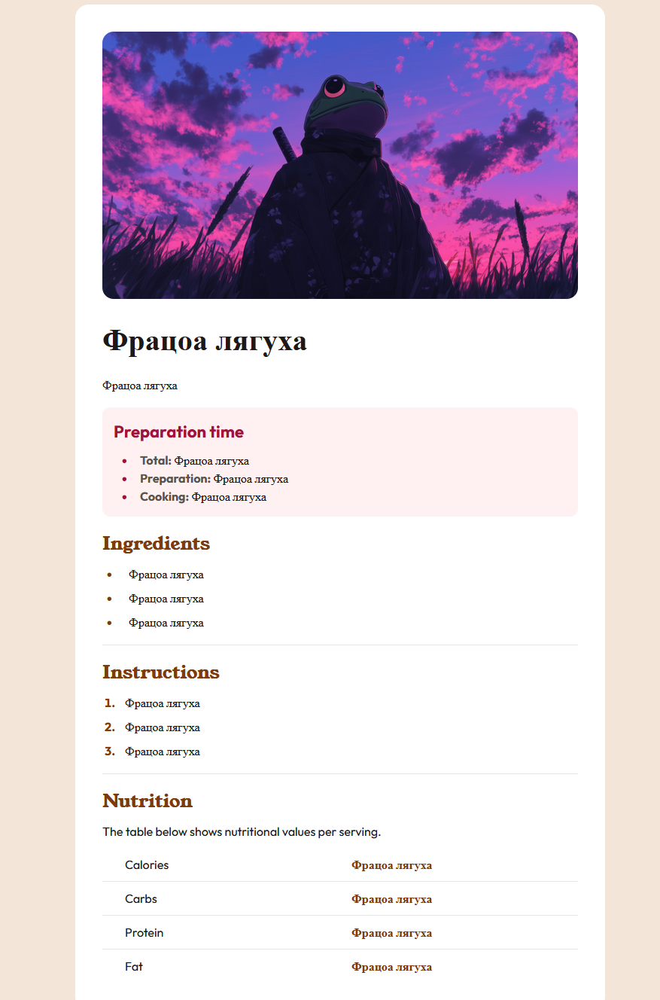

---

## What I Added / Fork Improvements

In this fork, I enhanced the original Recipe page by adding an interactive recipe creation feature:

* Implemented a modal form that opens when the user clicks the **“Add Recipe”** button.
* The form allows users to input all recipe details, including title, description, image upload (with customizable dimensions), preparation times, ingredients, instructions, and nutritional information.
* Upon submitting, the new recipe is dynamically rendered as a styled recipe card consistent with the original design and appended to the page without reload.
* The modal form improves user experience by overlaying the form over the content, focusing attention and keeping the interface clean.
* Added basic validation to ensure an image is selected before adding a recipe.

This feature enables users to create and view custom recipes seamlessly within the app while maintaining the original design’s look and feel.

---